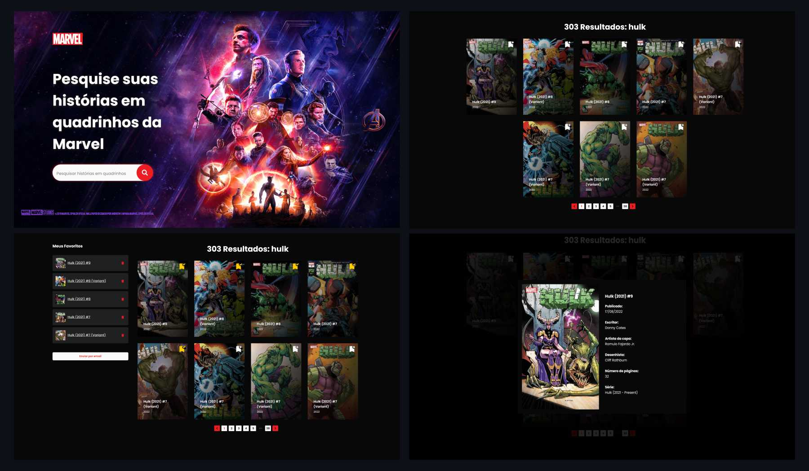

## Sobre o projeto

O projeto foi desenvolvido visando cumprir o desafio de frontend proposto pela empresa [Softdesign](https://softdesign.com.br/), o desafio consiste em criar uma SPA para consulta e listagem de quadrinhos utilizando a API da [MARVEL](https://developer.marvel.com).

Disponível em: [https://softdesign-frontend.vercel.app/](https://softdesign-frontend.vercel.app/)

## Funcionamento

A tela principal exibe uma imagem dos vingadores, com um input de pesquisa, ao pesquisar sobre determinado quadrinhos, a página rola até uma lista de quadrinhos com paginação, nessa lista temos cards que exibem a capa, título e ano do quadrinho, ao clicar na imagem, abre uma modal com mais informações do quadrinho, ao clicar no ícone de favoritos, exibe ao lado uma lista de quadrinhos favoritados, tendo opção de enviar por email os favoritos ao clicar no botão e inserir o email. Caso o usuário insira uma url que não é invalida,
retorna uma página de erro 404 - página não encontrada. 



## Solução adotada

- A aplicação foi construída com React, utilizando a ferramenta Vite.
- A ferramenta Vite visa fornecer uma experiência de desenvolvimento mais rápida e enxuta para projetos web modernos.
- Foi utilizado no projeto Typescript, Lint.
- Construído base nos princípios do Solid.
- Foi utilizado gerenciamento de estado com ContextApi.
- O layout responsivo (web | mobile) foi construído com Styled Components e utilizado tema personalizável.
- O formulário de pesquisa, foi utilizado o react-hook-form com o validador yup.
- Para envio do email, foi utilizado a ferramenta EmailJs, onde permite enviar e-mails pelo frontend.

## Tecnologias

- React 18
- Vite
- Typescript
- Styled Components
- Axios

## Requisitos 

- NodeJS
- NPM ou YARN

## Como executar? 

- Instalar as dependências

```sh
$ npm install
```

- Inserir variáveis de ambiente

```sh
$ .env.example
```

- Rodar o projeto

```sh
$ npm run dev
```

- Criar uma versão de distribuição

```sh
$ npm run build
```

- Visualizar a distribuição no localhost

```sh
$ npm run preview
```

## Autor 📚

- [GitHub](https://github.com/thelucasgarcia)
- [LinkedIn](https://linkedin.com/in/lucas-garcia-santos)
- [Email](mailto:thelucasgarcia@gmail.com)
